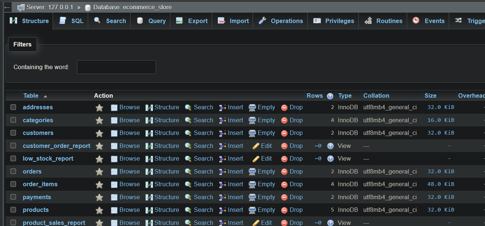
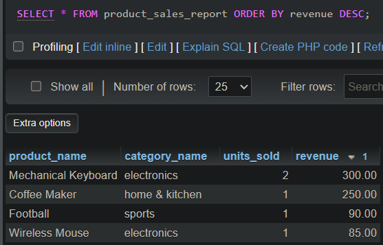
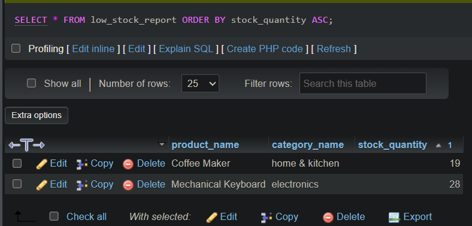

# E-Commerce SQL Database Project

## Project Overview

This project is a relational e-commerce database built using SQL in a MySQL-compatible environment with XAMPP and phpMyAdmin.

The database was created as a practical "learning" project to understand how an e-commerce store can organize and connect data such as customers, products, categories, orders, payments, addresses, and inventory.

It also includes SQL queries and views for useful business reports such as product sales, customer spending, and low-stock monitoring.

## Database Structure

The database contains 7 main tables:

| Table | Purpose |
|---|---|
| `customers` | Stores customer information such as name, email, and phone number. |
| `addresses` | Stores customer address information. |
| `categories` | Stores product categories. |
| `products` | Stores product information, prices, stock quantities, and categories. |
| `orders` | Stores customer orders, order dates, status, and total amounts. |
| `order_items` | Connects orders with products and stores quantities and unit prices. |
| `payments` | Stores payment method, payment status, amount, and payment date. |

The project also contains 3 SQL views:

| View | Purpose |
|---|---|
| `customer_order_report` | Combines customer, order, and payment information into a reusable report. |
| `product_sales_report` | Shows units sold and revenue generated by each product. |
| `low_stock_report` | Identifies products with fewer than 30 units remaining in stock. |

## SQL Skills Demonstrated

This project demonstrates practical use of:

- Creating and managing databases and tables
- Primary keys and auto-incrementing IDs
- Foreign keys and table relationships
- One-to-many and many-to-many relationships
- Data types such as `INT`, `VARCHAR`, `DECIMAL`, and `DATETIME`
- `INSERT`, `SELECT`, `UPDATE`, and `DELETE`
- Filtering with `WHERE`, `AND`, `OR`, `BETWEEN`, `IN`, and `LIKE`
- Sorting and limiting results with `ORDER BY` and `LIMIT`
- `INNER JOIN` and `LEFT JOIN`
- Aggregate functions including `SUM()`, `COUNT()`, and `AVG()`
- `GROUP BY` and `HAVING`
- `DISTINCT` and `COALESCE()`
- Constraints including `NOT NULL`, `UNIQUE`, `DEFAULT`, and `CHECK`
- SQL views for reusable business reports
- Transactions using `START TRANSACTION`, `COMMIT`, and `ROLLBACK`
- Inventory updates and stock validation

## Business Reports

The database includes queries and views that can answer practical e-commerce questions, including:

- Which products generate the most revenue?
- Which products sell the most units?
- Which customers have spent the most?
- What is the total value of all orders?
- What is the average order value?
- Which payment methods are being used?
- How much revenue has been successfully paid?
- Which products are running low on stock?
- Which products have never been sold?

### Example: Low-Stock Monitoring

The `low_stock_report` view identifies products with fewer than 30 units remaining, helping identify products that may need restocking.

### Example: Product Sales Analysis

The `product_sales_report` view summarizes the number of units sold and revenue generated by each product.

## Screenshots

### Database Structure

The database contains 7 relational tables and 3 reusable SQL views.

### Product Sales Report

A sales report showing units sold and revenue generated by each product.

### Low-Stock Report

A report that identifies products with fewer than 30 units remaining.

## How to Run the Project

1. Install XAMPP and start Apache and MySQL.
2. Open phpMyAdmin.
3. Create a new database named `ecommerce_store`.
4. Select the database and open the Import tab.
5. Import the `ecommerce_store.sql` file.
6. After the import is complete, the tables, relationships, sample data, and views will be available in the database.

The project was developed and tested using MariaDB through XAMPP and managed with phpMyAdmin.

## Learning Purpose

This project was created as a hands-on learning project to develop practical SQL and relational database skills using an e-commerce scenario.

The goal was not only to write SQL queries, but also to understand how database relationships, transactions, inventory data, customer orders, payments, and business reporting can work together in a practical database.