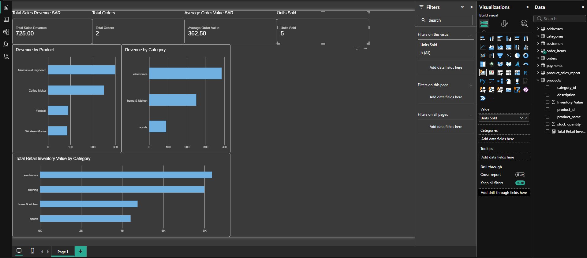

# E-Commerce Data Analysis Project

## Project Overview

This project is a practical e-commerce data analysis portfolio project using SQL, MariaDB, Excel, and Power BI.

The project demonstrates two data analysis workflows:

1. Building and analyzing a relational e-commerce database using SQL and MariaDB, then connecting the database to Power BI.
2. Analyzing e-commerce data in Microsoft Excel and using the prepared data to build a separate Power BI dashboard.

The goal of the project was to develop practical skills in database management, data analysis, business reporting, and data visualization using an e-commerce scenario.

---

## Tools Used

- SQL
- MariaDB
- XAMPP
- phpMyAdmin
- MySQL ODBC Connector
- Microsoft Excel
- Microsoft Power BI
- GitHub

---

# SQL & MariaDB Analysis

## Database Structure

The `ecommerce_store` relational database contains 7 main tables:

| Table | Purpose |
|---|---|
| `customers` | Stores customer information |
| `addresses` | Stores customer addresses |
| `categories` | Stores product categories |
| `products` | Stores products, prices, inventory, and categories |
| `orders` | Stores customer orders, dates, status, and totals |
| `order_items` | Connects orders with products and stores quantities and unit prices |
| `payments` | Stores payment methods, status, amounts, and payment dates |

The database also contains 3 reusable SQL views:

| View | Purpose |
|---|---|
| `customer_order_report` | Combines customer, order, and payment information |
| `product_sales_report` | Calculates units sold and revenue by product |
| `low_stock_report` | Identifies products with fewer than 30 units in stock |

## SQL Skills Demonstrated

- Creating and managing databases and tables
- Primary keys and auto-incrementing IDs
- Foreign keys and relational database relationships
- One-to-many and many-to-many relationships
- `INSERT`, `SELECT`, `UPDATE`, and `DELETE`
- Filtering with `WHERE`, `AND`, `OR`, `BETWEEN`, `IN`, and `LIKE`
- `INNER JOIN` and `LEFT JOIN`
- `SUM()`, `COUNT()`, and `AVG()`
- `GROUP BY` and `HAVING`
- `ORDER BY` and `LIMIT`
- `DISTINCT` and `COALESCE()`
- `NOT NULL`, `UNIQUE`, `DEFAULT`, and `CHECK` constraints
- SQL views for reusable business reports
- Transactions using `START TRANSACTION`, `COMMIT`, and `ROLLBACK`
- Inventory updates and stock validation

## SQL Business Analysis

The database can answer business questions such as:

- Which products generate the most revenue?
- Which products sell the most units?
- Which customers spend the most?
- What is the total order value?
- What is the average order value?
- Which payment methods are being used?
- How much revenue has been successfully paid?
- Which products are running low on stock?
- Which products have never been sold?

---

# MySQL / MariaDB Power BI Dashboard

The relational database was connected to Microsoft Power BI through an ODBC connection.

This dashboard demonstrates how SQL database data can be used directly for business intelligence and visualization.

The dashboard includes:

- Total Revenue
- Total Orders
- Average Order Value
- Revenue by Product
- Units Sold by Product
- Revenue by Category
- Revenue by Payment Method
- Current Stock by Product
- Customer Spending

The dashboard uses both relational database tables and the `product_sales_report` SQL view.

## MySQL Power BI Dashboard

## MySQL Product Sales Report

---

# Excel Data Analysis

The project also includes a separate e-commerce data analysis workflow completed in Microsoft Excel.

The Excel workbook demonstrates practical spreadsheet-based data preparation, analysis, and reporting.

Skills practiced include:

- Cleaning and preparing data
- Excel tables
- Sorting and filtering
- Basic arithmetic formulas
- `IF`
- `TRIM`
- `UPPER` and `PROPER`
- `LEN`
- `LEFT`, `RIGHT`, and `MID`
- Text concatenation
- `TEXTJOIN`
- Working with dates
- Extracting month and year information
- PivotTables
- Business summaries
- Dashboard preparation
- Writing business conclusions from analyzed data

The Excel analysis provides another way to work with e-commerce data without relying exclusively on a relational database.

---

# Excel Data Power BI Dashboard

The analyzed Excel data was also used to create a separate Power BI dashboard.

This demonstrates a second analytics workflow:

**Excel Data → Data Analysis → Power BI → Business Visualization**

## Excel Power BI Dashboard

---

# Skills Demonstrated

This project demonstrates practical experience with:

### Database & SQL
- Relational database design
- SQL querying
- Database relationships
- Data aggregation
- SQL views
- Transactions
- Business reporting

### Excel
- Data cleaning
- Formulas and text functions
- Date analysis
- PivotTables
- Spreadsheet-based business analysis
- Dashboard preparation

### Power BI
- Connecting Power BI to a relational database using ODBC
- Importing Excel-based data
- Creating KPI cards
- Creating business visualizations
- Sales analysis
- Product and category analysis
- Customer analysis
- Inventory analysis
- Dashboard development

### Business Analysis
- Revenue analysis
- Product performance
- Customer spending
- Payment analysis
- Inventory monitoring
- E-commerce KPI reporting

---

# Project Files

- `ecommerce_store.sql` — SQL/MariaDB database export
- `mysql-ecommerce_store-dashboard.pbix` — Power BI dashboard connected to the SQL/MariaDB database
- `ecommerce-data-analysis.xlsx` — Excel e-commerce data analysis workbook
- `ecommerce-dashboard-final.pbix` — Power BI dashboard created from the Excel analysis
- `screenshots/` — Database, SQL report, and Power BI dashboard screenshots

---

# How to Run the SQL Database

1. Install XAMPP.
2. Start Apache and MySQL.
3. Open phpMyAdmin.
4. Create a database named `ecommerce_store`.
5. Select the database and open the **Import** tab.
6. Import `ecommerce_store.sql`.
7. The tables, relationships, sample data, and SQL views will then be available.

The database was developed and tested using MariaDB through XAMPP and managed using phpMyAdmin.

---

# Learning Purpose

This project was developed as a hands-on learning project to build practical data analysis skills in an e-commerce context.

Instead of focusing only on individual software tools, the project explores different ways business data can be stored, cleaned, analyzed, and visualized using SQL, Excel, and Power BI.

The project demonstrates a practical progression from raw business data and relational database concepts to analysis, reporting, and dashboard visualization.
